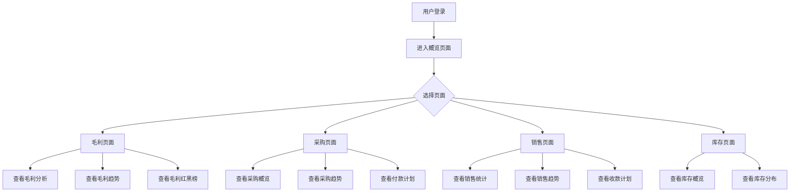
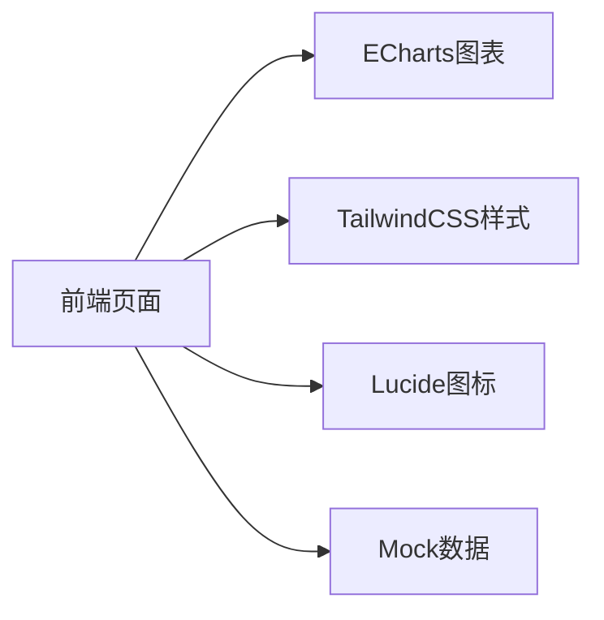
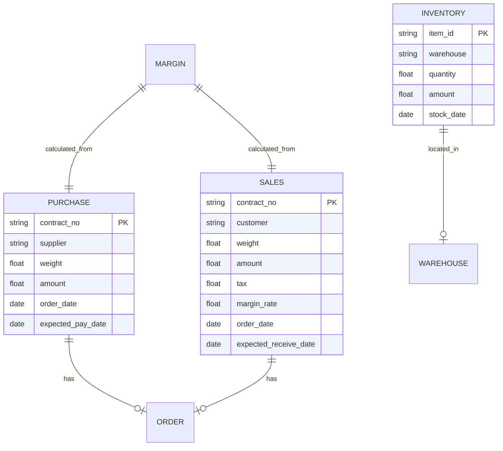

企业BI数据分析仪表盘 - PRD文档


目录
1. 产品概述	3
 2. 核心功能	3
2.1 用户角色	3
2.2 功能模块	3
2.3 页面详情	3
 3. 核心流程	4
 4. 用户界面设计	5
4.1 设计风格	5
4.2 页面设计概览	5
 5. 技术架构	5
 6. 项目文件结构	7
 7. 核心功能清单	7


 1. 产品概述

本产品是一款企业级BI数据分析仪表盘，旨在帮助企业管理层快速掌握采购、销售、库存、毛利等核心业务数据，支持数据可视化展示和趋势分析，提升决策效率。

目标用户：企业管理层、业务分析师  
核心价值：实时数据可视化、智能分析、决策支持

---

 2. 核心功能

 2.1 用户角色

| 角色 | 注册方式 | 核心权限 |
|------|----------|----------|
| 管理员 | 系统配置 | 完整数据查看、权限管理 |
| 业务用户 | 账号分配 | 数据查看、报表导出 |

我们目前把登录入口还是放在久创自营系统里面，新增一个模块叫管理员驾驶舱。


 2.2 功能模块

1. 概览页面：年度采购、年度销售、库存数据、年度毛利
2. 毛利页面：毛利分析、毛利月度总览、毛利红榜TOP5、毛利黑榜TOP5
3. 采购页面：采购概览、采购趋势、商品采购单价趋势、付款计划、供应商TOP5
4. 销售页面：销售统计、销售趋势、商品销售趋势、收款计划、销售客户TOP5
5. 库存页面：实时库存、在库库存、在途库存、今日出入库、出入库统计、历史库存、库存仓库分布、库存金额占比

 2.3 页面详情

| 页面名称 | 模块名称 | 功能描述 |
|----------|----------|----------|
| 概览 | 年度采购 | 展示年度采购重量、采购金额 |
| 概览 | 年度销售 | 展示年度销售重量、销售金额、未收金额 |
| 概览 | 库存数据 | 展示实时库存、在库库存、在途库存 |
| 概览 | 年度毛利 | 展示毛利额、毛利率 |
| 概览 | 采购未支付金额 | 展示未支付总金额 |
| 毛利 | 毛利分析 | 毛利额、毛利率、亏损订单毛利额KPI卡片 |
| 毛利 | 毛利月度总览 | 月度毛利趋势图表 |
| 毛利 | 毛利红榜TOP5 | 毛利最高的5个产品排行 |
| 毛利 | 毛利黑榜TOP5 | 毛利最低的5个产品排行 |
| 采购 | 采购概览 | 采购合同数、采购重量、采购金额、税费、未付金额 |
| 采购 | 采购趋势 | 采购金额/重量趋势图表 |
| 采购 | 付款计划 | 合同号、收款公司、付款款项、预计付款金额、预计付款时间 |
| 采购 | 供应商TOP5 | 采购金额最高的5个供应商排行 |
| 销售 | 销售统计 | 销售合同数、销售重量、销售金额、税费、未收金额、毛利率 |
| 销售 | 销售趋势 | 销售趋势图表 |
| 销售 | 商品销售趋势 | 按品类/国家/厂号/件套筛选的销售趋势图表 |
| 销售 | 收款计划 | 合同号、付款公司、付款款项、预计收款金额、预计收款时间 |
| 销售 | 销售客户TOP5 | 销售额最高的5个客户排行 |
| 库存 | 实时库存 | 实时库存数量、库存金额 |
| 库存 | 在库库存 | 在库重量、金额明细 |
| 库存 | 在途库存 | 在途重量、合同金额 |
| 库存 | 今日出入库 | 今日入库、出库数据 |
| 库存 | 入库统计 | 入库趋势图表 |
| 库存 | 库存仓库分布 | 各仓库库存占比图表 |
| 库存 | 库存金额占比_库龄 | 不同库龄库存金额占比 |

---

 3. 核心流程



---

 4. 用户界面设计

 4.1 设计风格

- 主色调：深蓝色背景(0d1117)，深色卡片(1a1d24)
- 强调色：青色(4c8bf5)、绿色(3ba272)、黄色(e3b341)、红色(ef4444)
- 按钮样式：圆角矩形、深色背景、hover高亮
- 字体：Inter，标题16-18px，内容12-14px，数据14-18px
- 布局：卡片式布局、网格系统、顶部导航

 4.2 页面设计概览

| 页面名称 | 模块名称 | UI元素 |
|----------|----------|--------|
| 所有页面 | 顶部导航 | Logo、导航菜单、时间筛选 |
| 概览 | KPI卡片 | 图标、标题、数值、单位 |
| 图表模块 | 图表容器 | ECharts图表、标题、图例 |
| 表格模块 | 数据表格 | 表头、数据行、hover效果 |
| 计划模块 | 金额汇总 | 居中显示、高亮数值 |

 4.3 响应式设计

- 桌面端(1920×1080)：完整布局，多列网格
- 平板端：自适应列数，保持可读性
- 移动端：单列布局，紧凑显示

---

 5. 技术架构

 5.1 架构设计



 5.2 技术栈

| 分类 | 技术 | 版本 |
|------|------|------|
| 前端框架 | HTML + JavaScript | - |
| 样式 | TailwindCSS | 3.x |
| 图表库 | ECharts | 5.x |
| 图标库 | Lucide Icons | - |
| 构建工具 | Vite | 6.x |

 5.3 页面路由

| 路由 | 用途 |
|------|------|
| /overview | 概览页面 |
| /margin | 毛利页面 |
| /purchase | 采购页面 |
| /sales | 销售页面 |
| /inventory | 库存页面 |

 5.4 数据模型



---

 6. 项目文件结构

```
.
├── index.html           主页面（包含所有页面内容和脚本）
├── package.json         项目配置
├── vite.config.js       Vite配置
├── PRD_Document.md      PRD文档
└── assets/
    └── icons/           图标资源
```

---

 7. 核心功能清单

| 功能 | 状态 | 说明 |
|------|------|------|
| 页面导航 | ✅ | 顶部标签切换 |
| KPI卡片 | ✅ | 数据展示 |
| 图表可视化 | ✅ | ECharts绑定 |
| 数据表格 | ✅ | 排行数据展示 |
| 时间筛选 | ✅ | 今日/本周/本月/今年/自定义 |
| 条件筛选 | ✅ | 品类/国家/厂号/件套 |
| 付款计划 | ✅ | 采购付款计划管理 |
| 收款计划 |